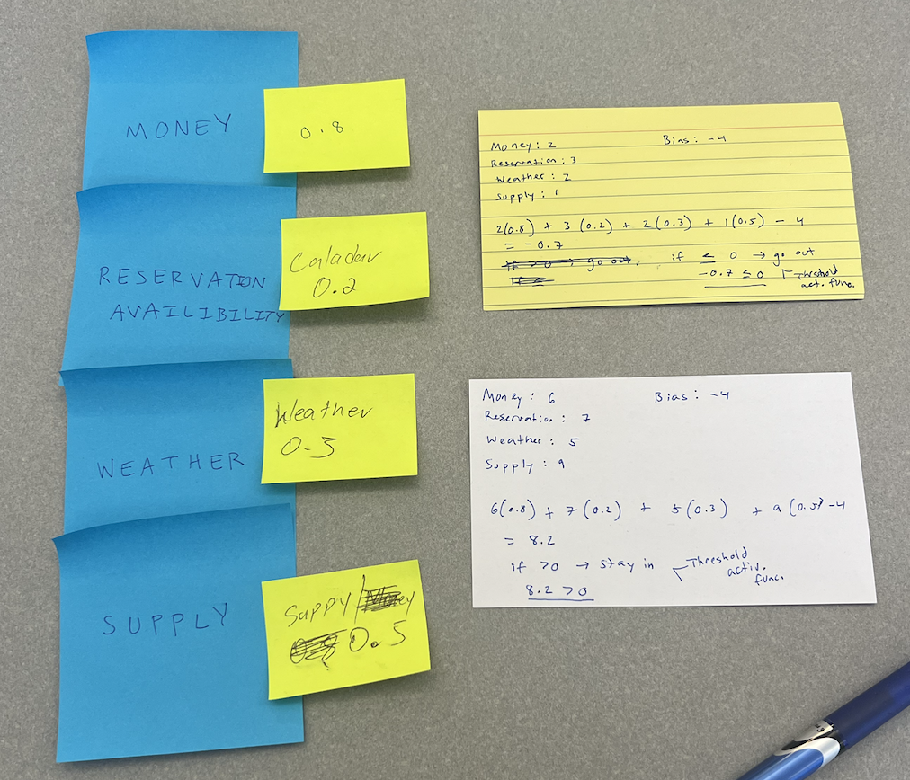

## Names: Chloe Bonson, Daniel Bekele

### Network Image

### Performance

Did the network's output make sense?
- Our network was used to determine if one should go out to eat or stay in. Our results made sense for the input values given in comparison to the threshold, which was 0 in this case. As the inputs increased and bias remained constant, the likelihood of staying in to eat became higher as well. The opposite was true for going out to eat.

How could you adjust weights or activation functions to improve accuracy?
- Our current activation function is binary, where the output is either yes or no. Finding a way to better normalize the data would better scale the inputs and make the outcome of the function more true to the data. This could also impact weight application and the effect of biases. This normalization could be done through approaches such as typical Z-Score normalization (subtract the mean and divide by the std. dev.); this would be useful if the data is normally distributed.

What did you notice about how small changes (e.g., weights) affect outcomes?

- Small changes in weights can give more or less value to an input's effect on the outcome; this is also true for the bias value. We found that volatility and weights/bias have a positive correlation, whereby the output values become more susceptible to change when the weights or bias value increase by larger amounts. This means that measuring the weights in terms of some sort of scale for each input would best accurately reflect the values.

### Ethics

What potential biases or ethical considerations could arise in your example scenario?

There could be some cultural biases since some cultures may lean more towards certain dining preferences based on their background. This may impact the outcomes despite the given input values and the activation function. Ethically, the model may imply more negative feelings towards eating in because the "worse" input values lead to those results. For instance, the higher input values indicate the amount of struggle or difficulty in each input, meaning someone with high financial struggle is going to lean more towards eating in based on our activation function. This may shift viewpoints on eating in versus going out. 

### Reflection

What was easy to understand about the neural network?
- It was easy to grasp the threshold concepts and the determination of weight values. Certain aspects like weather typically hold less importance than money when deciding where to eat, so deciding these weights was rather intuitive.

What challenges did they face?
- It was difficult to determine how to assign values to the inputs because of the scale we used. We based each input value on level of difficulty or struggle, meaning that a higher value is considered "worse off." For instance, a higher value for money would mean lower amount and a higher value for weather would mean poorer conditions. This made it more difficult to conceptualize what the threshold value meant, but we were able to decide that being over the threshold of 0 indicates staying in to eat, while the opposite is true for going out to eat. 
